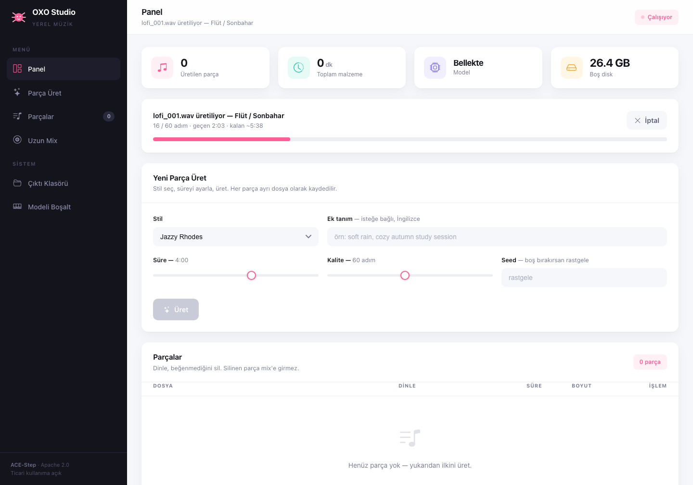
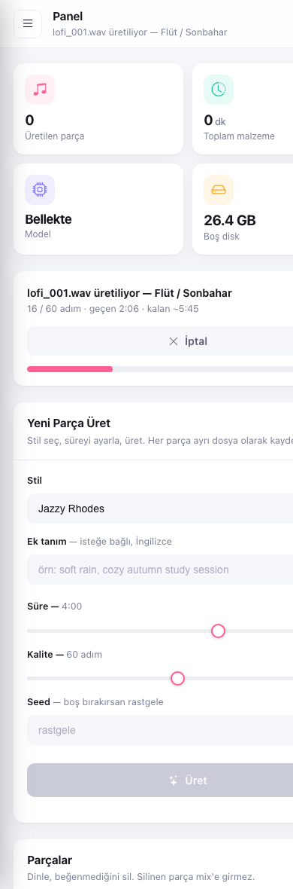

<div align="center">


# OXO Studio

**MacBook'unuzda yerel çalışan, ticari kullanıma açık müzik üretim arayüzü**

Bulut yok, abonelik yok, telif riski yok. Model sizin makinenizde çalışır,
ürettiğiniz müzik sizde kalır.

<sub>Adını, hayatı boyunca tüy gibi kalan ve kendini yenileyebilen
<a href="https://tr.wikipedia.org/wiki/Aksolotl">aksolotl</a>'dan alır.</sub>

</div>

---

## Ne işe yarar?

YouTube videoları, yayınlar, podcast'ler ve uygulamalar için **arka plan müziği**
üretir. Tarayıcıdan tek tuşla parça üretir, dinler, beğenmediğinizi siler; sonra
beğendiklerinizi crossfade ile birleştirip **saatlerce süren kesintisiz bir mix**
çıkarır.

Tipik kullanım: 15 parça üretirsiniz (≈1 saat benzersiz malzeme), tek tuşla
3 saatlik mix'e dönüştürürsünüz.

## Neden bu model? (Lisans meselesi)

Yerel müzik üretiminde asıl soru "hangisi daha iyi ses veriyor" değil,
**"ürettiğimi ticari olarak kullanabilir miyim"**. Üç yaygın seçenek:

| Model | Lisans | Ticari kullanım |
|---|---|---|
| **ACE-Step v1-3.5B** | **Apache 2.0** | ✅ Serbest — kod ve ağırlıklar dahil |
| MusicGen (Meta) | CC-BY-NC 4.0 | ❌ Ağırlıklar ticari kullanıma kapalı |
| Stable Audio Open | Stability Community License | ⚠️ Ciro eşiğine kadar, sonrası ücretli |

MusicGen ses kalitesiyle popüler ama **ağırlıkları CC-BY-NC**, yani parayla
ilişkili hiçbir işte kullanılamaz. Stable Audio Open belli bir gelir eşiğine
kadar serbest, sonrasında lisans gerektirir. **ACE-Step ise hem kodu hem model
ağırlıklarıyla Apache 2.0** — bu yüzden OXO Studio onun üzerine kuruldu.

> **Dürüst not:** Model lisansı ticari kullanıma izin veriyor, ancak AI üretimi
> müziğin *telif sahipliği* (başkasının kullanmasını engelleyebilme hakkı)
> birçok ülkede hukuken net değil. Videonuzda kullanmak sorunsuz; müziği
> üçüncü kişilere lisanslamayı planlıyorsanız kendi ülkenizin mevzuatına bakın.

## Ekran görüntüleri

| Panel | Mobil |
|---|---|
|  |  |

## Kurulum

**Gereksinimler:** Apple Silicon Mac (M1/M2/M3/M4), 16 GB RAM önerilir,
~12 GB boş disk, Python 3.10–3.12, ffmpeg.

```bash
brew install python@3.11 ffmpeg
git clone https://github.com/Cerensen7/oxo-studio.git
cd oxo-studio
./kur.sh
```

`kur.sh` ACE-Step kaynak kodunu klonlar, sanal ortam kurar ve bağımlılıkları
indirir (~3 GB). Model ağırlıkları (~8.3 GB) ilk üretimde otomatik iner —
panelden ilerlemesini izleyebilirsiniz.

## Kullanım

**`OXO Studio.command`** dosyasına çift tıklayın. Terminal penceresi açılır
(kapatmayın, sunucu orada çalışır) ve tarayıcıda panel gelir:
`http://127.0.0.1:7878`

### Panel bölümleri

**İstatistikler** — Kaç parça ürettiğiniz, toplam kaç dakika malzemeniz olduğu,
modelin durumu (indi mi, bellekte mi) ve kalan disk alanı.

**Parça Üret** — 15 hazır lo-fi stili arasından seçin (Jazzy Rhodes, Naylon
Gitar, Vibrafon/Yağmur, Kahve Dükkânı, Flüt/Sonbahar…), isterseniz İngilizce ek
tanım yazın (`cozy autumn study session, soft rain`), süre ve kaliteyi ayarlayın,
**Üret**'e basın. İlerleme çubuğu modelin **gerçek difüzyon adımlarını** gösterir
— tahmini kalan süreyle birlikte. İstediğiniz an iptal edebilirsiniz.

**Seri Üretim** — Tek tuşla 2–40 parça üretir, stilleri sırayla dolaşarak
her birini farklı yapar. Arkada çalışır, panelde `3 / 10 tamamlandı` şeklinde
ilerler, istediğiniz an durdurulur (çalışan parça bitince durur).

**Parçalar** — Her parçayı panelden dinleyin, indirin veya silin. Sildiğiniz
parça mix'e girmez. Her parçanın seed'i kaydedilir, beğendiğiniz bir parçayı
birebir tekrar üretebilirsiniz.

**Uzun Mix** — Hedef süreyi seçin (0.5–6 saat), geçiş uzunluğunu ve ses
seviyesini ayarlayın. Parçaları karıştırıp aynı parçayı arka arkaya koymadan
dizer, crossfade ile bağlar, seviyeleri `loudnorm` ile eşitler ve tek MP3'e
yazar. Elinizdeki malzemeye göre *"her parça ortalama 2.4 kez tekrarlanacak"*
uyarısı verir, böylece kaç parça daha üretmeniz gerektiğini görürsünüz.

**Modeli Boşalt** — Model bellekte ~7 GB tutar. İşiniz bittiğinde bununla
RAM'i geri alırsınız.

### Terminal (isteğe bağlı)

Toplu üretim için:

```bash
./venv/bin/python uret.py --adet 15 --sure 240
./venv/bin/python birlestir.py --saat 3
```

| Script | Parametre | Açıklama |
|---|---|---|
| `uret.py` | `--adet` | Kaç parça üretilecek |
| | `--sure` | Parça uzunluğu (saniye) |
| | `--adim` | Difüzyon adımı — az: hızlı/kaba, çok: yavaş/temiz |
| | `--baslangic` | Dosya numarası başlangıcı |
| `birlestir.py` | `--saat` | Hedef mix uzunluğu |
| | `--xfade` | Geçiş süresi (saniye) |
| | `--lufs` | Ses seviyesi — konuşma altında kalacaksa `-20` |
| | `--bitrate` | MP3 kalitesi |

## Kullanılan teknolojiler

| Katman | Seçim | Neden |
|---|---|---|
| Model | [ACE-Step v1-3.5B](https://github.com/ace-step/ACE-Step) | Apache 2.0, ticari kullanıma açık |
| Hızlandırma | PyTorch + Metal (MPS) | Apple Silicon GPU'sunu kullanır |
| Arka uç | FastAPI + Uvicorn | Hafif, arka plan işleri ve canlı durum için yeterli |
| Arayüz | Saf HTML/CSS/JS | Derleme adımı yok, tek dosya, internetsiz çalışır |
| Ses işleme | ffmpeg (`acrossfade`, `loudnorm`) | Crossfade ve seviye eşitleme |

Arayüzde build aracı, npm bağımlılığı veya CDN yok. Tek dış varlık ikon fontu,
o da repoda yerel olarak duruyor.

## Apple Silicon'a özel iki ayar

Bu iki detay olmadan proje 16 GB'lık bir Mac'te düzgün çalışmaz:

**1. float16 zorlaması.** ACE-Step pipeline'ı MPS algıladığında dtype'ı
`float32`'ye sabitliyor. 3.5 milyar parametre fp32 demek ~14 GB RAM demek —
16 GB'lık makine swap'e girer. `ACE_PIPELINE_DTYPE=float16` ile bu eziliyor,
bellek ~7 GB'a iniyor.

**2. Xet indiricisinin kapatılması.** `huggingface_hub`'ın yeni Xet arka ucu
dosyayı ancak indirme bitince diske yazar; panelin ilerleme çubuğu klasör
boyutunu okuduğu için %0'da takılı kalıp birden %100'e atlıyordu.
`HF_HUB_DISABLE_XET=1` ile klasik indiriciye geçiliyor.

İkisi de [`arayuz/sunucu.py`](arayuz/sunucu.py) başında ayarlanır.

## Ses kalitesi: ölçerek ayarlamak

Bu projenin ayarları tahminle değil, referans parçalar ölçülerek seçildi.
Beğenilen lo-fi parçalarla ham model çıktısı aynı metriklerle karşılaştırıldı:

| Metrik | Referans lo-fi | Ham çıktı | Sonuç |
|---|---|---|---|
| Spektral merkez | ~546 Hz | 2480 Hz | **4.5× parlak** |
| Nota entropisi | 3.53 | 3.49 | Fark yok |
| Olay / saniye | 3.59 | 2.70 | Fark yok |

Tek anlamlı fark ton rengiydi. Model "low pass filtered" etiketini
dikkate almıyor; çözüm üretim sonrası filtre zinciri oldu:

```
highpass=60×2  →  uğultuyu 9 dB düşürür, müzikal bastan 0.9 dB götürür
afftdn nr=18   →  hışırtıyı 8.4 dB düşürür
lowpass=1500   →  spektral merkezi 2480 → 555 Hz'e indirir
treble -6dB    →  kalan tizliği yumuşatır
alimiter       →  kırpılmaya karşı emniyet
```

Her üretim bu zincirden otomatik geçer. Zincir patlarsa ham dosya korunur.

### Prompt dersleri

- **Uzun etiket listesi zarar veriyor.** 30 etiketten 12'ye inince katman
  yoğunluğu %47 azaldı.
- **`warm vinyl crackle` istemeyin.** Modelden cızırtı isterseniz verir;
  arka planda sürekli hışırtı olarak duyulur.
- **`guidance_scale` 15 çok yüksek.** 9 daha seyrek ve sakin sonuç verir.
- **Ton bilgisi (`in A minor`) işe yaramıyor.** Metin koşullaması armonik
  yapıyı yönlendirmiyor — bu modelin yapısal sınırı.

## Performans (MacBook Air M2, 16 GB)

| İşlem | Süre |
|---|---|
| Modelin belleğe ilk yüklenmesi | ~1–2 dk (sonraki üretimlerde yok) |
| 3 dakikalık parça, 60 adım | 8–18 dk (bellek baskısına göre değişir) |
| 4 dakikalık parça, 60 adım | 14–20 dk |
| 3 saatlik mix birleştirme | ~1–2 dk |

## Lisans

Bu proje **MIT** lisanslıdır — bkz. [LICENSE](LICENSE).

ACE-Step modeli ve ağırlıkları **Apache 2.0** lisanslıdır ve ayrı bir projedir:
[ace-step/ACE-Step](https://github.com/ace-step/ACE-Step).

---

<div align="center">
<sub>© 2026 — Ceren Şen</sub>
</div>
